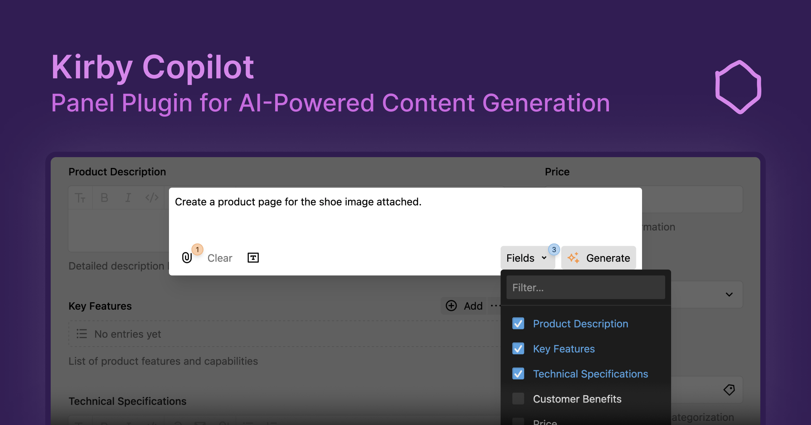

# Kirby Copilot

Kirby Copilot is a plugin for [Kirby CMS](https://getkirby.com) that integrates AI features into your Kirby projects, allowing you to generate structured content and entire page layouts directly from the Panel. This documentation will guide you through the installation, configuration and usage of the plugin.

::tip
Explore the [interactive playground](https://try.kirbycopilot.com) or [install the plugin](https://kirby.tools/docs/copilot/getting-started/installation) to try Kirby Copilot for yourself.
::

## Features

The following features make AI-assisted content creation and editing easy for you and your clients or editors:

- 🦙 **Multi-model**: Use OpenAI models, Google Gemini, Anthropic Claude, or Mistral AI models to generate content.
- 🧱 **Structure-Aware Generation**: Generate entire layouts from a single prompt, based on your project's unique block definitions.
- 📇 **In-Context Editing**: Use the Copilot button in writer/textarea fields to refine text with AI assistance. Works perfectly with selected text.
- 🌞 **Customizable prompts**: Tailor AI responses with user and system instructions.
- 🎀 **Rich Context**: Go beyond text. Use other fields, images, and even PDF documents as context for more accurate and relevant AI responses.

## Licensing

Kirby Copilot is a commercial plugin that requires a license. You can install and test the plugin locally without a license. However, production environments require a valid license. You can purchase a license from the [Kirby Copilot Website](https://kirby.tools/copilot/buy).

## Getting Started

To get started, please refer to the [documentation](https://kirby.tools/docs/copilot/getting-started) for guidance on installation, configuration, and usage.

Here are some quick links:

- [Installation](https://kirby.tools/docs/copilot/getting-started/installation)
- [Global Configuration](https://kirby.tools/docs/copilot/configuration/global)
- [Section Configuration](https://kirby.tools/docs/copilot/configuration/section)

## Support and Questions

We are committed to support you if you have any questions or issues with Kirby Copilot. There are several ways to get support:

- **GitHub Discussions**: Join the community and engage in discussions on our [GitHub Discussions page](https://github.com/kirby-tools/community/discussions).
- **Email Support**: You can ask questions and seek assistance by emailing us at [hello@kirby.tools](mailto:hello@kirby.tools). Please use the GitHub discussions if you have a general question or comment about Kirby Content Translator.
- **GitHub Issues**: For reporting bugs or requesting new features, please use the [GitHub Issues page](https://github.com/kirby-tools/community/issues).

We encourage you to use the resources above to connect with us and other users of Kirby Copilot.

For the sake of reproducible bug reports, please include the following information in your bug reports:

- Kirby & Kirby Copilot version
- Browser environment (name, version, operating system)
- Global and section configuration (without any sensitive information)
- Steps to reproduce the bug (if no reproduction is provided)
- Screenshots or screen recordings if applicable

> [!WARNING]
> Please ensure to **never** include any API keys or other sensitive information in bug reports, feature requests, or any other public communication channel.

## Feedback

We value your feedback and ideas for improving Kirby Copilot. If you have any suggestions, please feel free to reach out to us via email or preferably by creating a new discussion on our [GitHub Discussions page](https://github.com/kirby-tools/community/discussions).

## License

[Kirby Tools License](./LICENSE.md) License © 2024-PRESENT [Johann Schopplich](https://github.com/johannschopplich)
