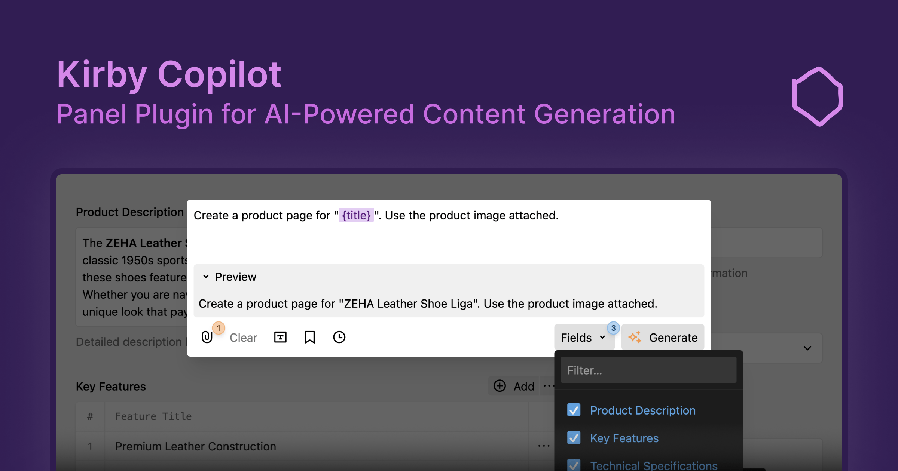

# Kirby Copilot

Kirby Copilot is a plugin for [Kirby CMS](https://getkirby.com) that integrates AI features into your Kirby projects. Generate and refine content – from simple text to complex page layouts – directly from the Panel, or drive AI from PHP for CLI scripts, hooks, and custom workflows.

> [!TIP]
> Explore the [interactive playground](https://try.kirbycopilot.com) or [install the plugin](https://kirby.tools/docs/copilot/getting-started/installation) to try Kirby Copilot for yourself.

## Features

Whether you are building sites for clients or managing content yourself, Kirby Copilot brings AI-assisted creation and editing to the Panel.

- 🦙 **Multi-Provider**: OpenAI, Anthropic, Google, or Mistral – switch anytime.
- 🧱 **Structure-Aware Generation**: Entire layouts from a single prompt, using your project's blocks.
- ⚡ **Inline Suggestions**: Ghost text after a brief pause – Tab to accept.
- 📇 **In-Context Editing**: Refine writer/textarea text, with selection awareness.
- 🌞 **Prompt Templates**: Save and reuse frequently-used prompts.
- 🎀 **Rich Context**: Other fields, images, and PDFs feed the AI.
- 🔒 **Secure by Default**: API keys stay server-side, never exposed to Panel users.
- 🛠 **PHP API**: Drive AI from CLI, hooks, and custom workflows – see [PHP classes](https://kirby.tools/docs/copilot/php-classes).

## Licensing

Kirby Copilot is a commercial plugin that requires a license. You can install and test the plugin locally without a license. However, production environments require a valid license. You can purchase a license from the [Kirby Copilot Website](https://kirby.tools/copilot/buy).

## Getting Started

To get started, please refer to the [documentation](https://kirby.tools/docs/copilot/getting-started) for guidance on installation, configuration, and usage.

Here are some quick links:

- [Installation](https://kirby.tools/docs/copilot/getting-started/installation)
- [Panel View Button](https://kirby.tools/docs/copilot/usage/view-button)
- [Blocks & Layouts Generation](https://kirby.tools/docs/copilot/usage/blocks-and-layouts)
- [Global Configuration](https://kirby.tools/docs/copilot/configuration/global)

## Support and Questions

We are committed to support you if you have any questions or issues with Kirby Copilot. There are several ways to get support:

- **GitHub Discussions**: Join the community and engage in discussions on our [GitHub Discussions page](https://github.com/kirby-tools/community/discussions).
- **Email Support**: You can ask questions and seek assistance by emailing us at [hello@kirby.tools](mailto:hello@kirby.tools). Please use the GitHub discussions if you have a general question or comment about Kirby Copilot.
- **GitHub Issues**: For reporting bugs or requesting new features, please use the [GitHub Issues page](https://github.com/kirby-tools/community/issues).

We encourage you to use the resources above to connect with us and other users of Kirby Copilot.

For the sake of reproducible bug reports, please include the following information in your bug reports:

- Kirby & Kirby Copilot version
- Browser environment (name, version, operating system)
- Global and section configuration (without any sensitive information)
- Steps to reproduce the bug (if no reproduction is provided)
- Screenshots or screen recordings if applicable

> [!WARNING]
> Please ensure to **never** include any API keys or other sensitive information in bug reports, feature requests, or any other public communication channel.

## Feedback

We value your feedback and ideas for improving Kirby Copilot. If you have any suggestions, please feel free to reach out to us via email or preferably by creating a new discussion on our [GitHub Discussions page](https://github.com/kirby-tools/community/discussions).

## License

[Kirby Tools License](./LICENSE.md) License © 2024-PRESENT [Johann Schopplich](https://github.com/johannschopplich)
