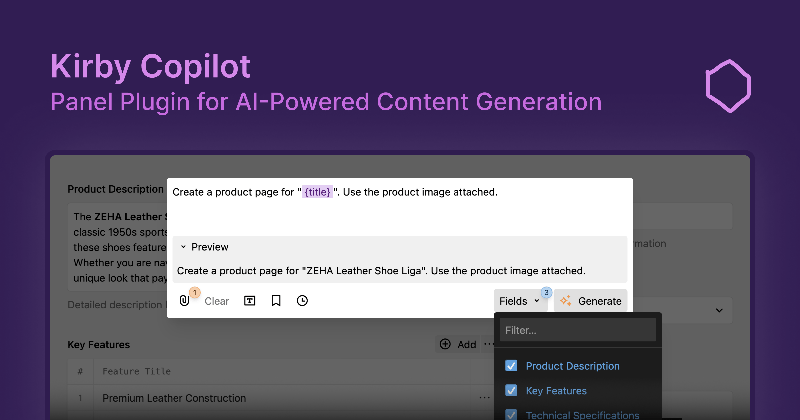

[](https://kirby.tools/copilot)

# Kirby Copilot

Kirby Copilot is a plugin for [Kirby CMS](https://getkirby.com) that brings AI assistance into the Panel without forcing a workflow. Pick the surfaces that fit your blueprints – view button, toolbar, inline suggestions, section – or skip them entirely and call the same provider stack from PHP.

> [!TIP]
> Explore the [interactive playground](https://try.kirbycopilot.com) or [install the plugin](https://kirby.tools/docs/copilot/getting-started/installation) to try Kirby Copilot for yourself.

## Features

Whether you are building sites for clients or managing content yourself, Kirby Copilot brings AI-assisted creation and editing to the Panel.

- 🧭 **View Button**: Fill several fields from one prompt, with files and other pages as context.
- 🧱 **Blocks & Layouts**: Whole layouts from your own block blueprints, custom blocks included.
- ⚡ **Inline Suggestions**: Ghost text after a pause – Tab keeps it.
- 📇 **Toolbar Buttons**: Rewrite or extend the selection in writer and textarea fields.
- 📚 **Skills**: Reusable instructions, pulled into any prompt with `@skill://`.
- 🌞 **Prompt Templates**: Save and reuse frequently used prompts.
- 🦙 **Multi-Provider**: OpenAI, Anthropic, Google, or Mistral – switch anytime.
- 🛠 **PHP API**: Drive AI from CLI, hooks, and custom workflows – see [PHP classes](https://kirby.tools/docs/copilot/php-classes).

## Licensing

Kirby Copilot is a commercial plugin that requires a license. You can install and test the plugin locally without a license. However, production environments require a valid license. You can purchase a license from the [Kirby Copilot Website](https://kirby.tools/copilot/buy).

## Requirements

- Kirby 4 or Kirby 5

## Installation

### Composer (Recommended)

```bash
composer require johannschopplich/kirby-copilot
```

### Manual Installation

Download and copy this repository to `/site/plugins/kirby-copilot`.

## Documentation

For installation, configuration, and usage, see the [Kirby Copilot documentation](https://kirby.tools/docs/copilot).

## Support and Questions

We are committed to support you if you have any questions or issues with Kirby Copilot. There are several ways to get support:

- **GitHub Discussions**: Join the community and engage in discussions on our [GitHub Discussions page](https://github.com/kirby-tools/community/discussions).
- **Email Support**: You can ask questions and seek assistance by emailing us at [hello@kirby.tools](mailto:hello@kirby.tools). Please use the GitHub discussions if you have a general question or comment about Kirby Copilot.
- **GitHub Issues**: For reporting bugs or requesting new features, please use the [GitHub Issues page](https://github.com/kirby-tools/community/issues).

We encourage you to use the resources above to connect with us and other users of Kirby Copilot.

For the sake of reproducible bug reports, please include the following information in your bug reports:

- Kirby & Kirby Copilot version
- Browser environment (name, version, operating system)
- Global and section configuration (without any sensitive information)
- Steps to reproduce the bug (if no reproduction is provided)
- Screenshots or screen recordings if applicable

> [!WARNING]
> Please ensure to **never** include any API keys or other sensitive information in bug reports, feature requests, or any other public communication channel.

## Feedback

We value your feedback and ideas for improving Kirby Copilot. If you have any suggestions, please feel free to reach out to us via email or preferably by creating a new discussion on our [GitHub Discussions page](https://github.com/kirby-tools/community/discussions).

## License

[Kirby Tools License](./LICENSE.md) © 2024-PRESENT [Johann Schopplich](https://github.com/johannschopplich)
